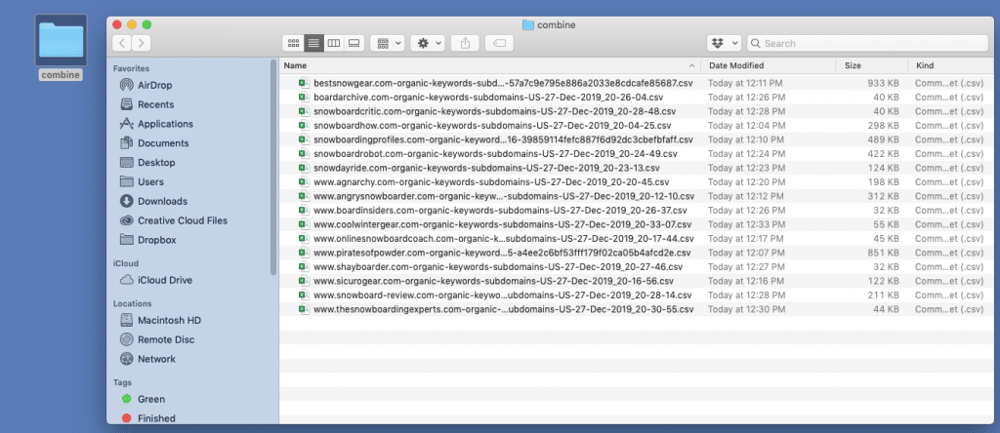
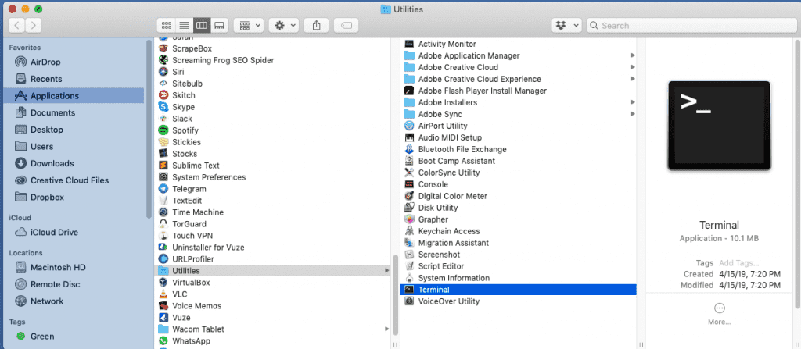
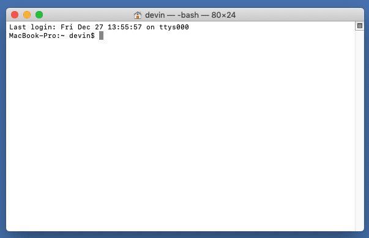
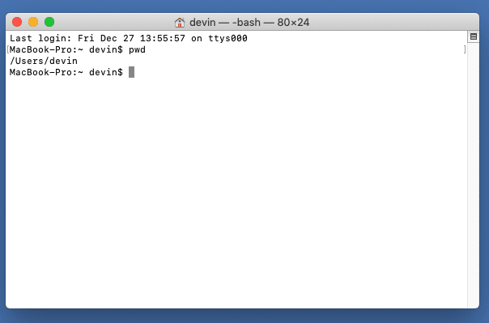
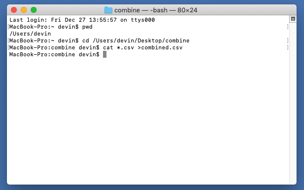
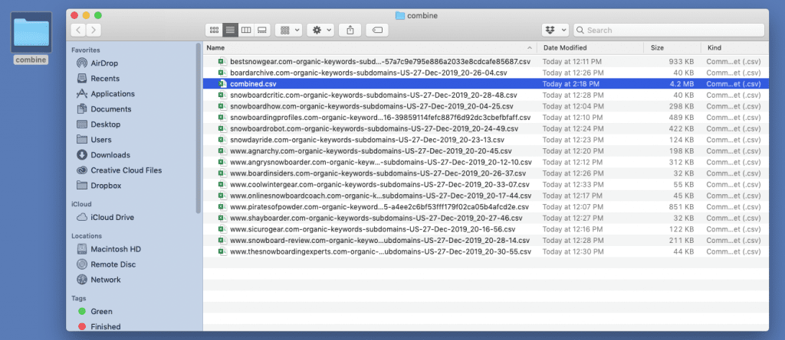

# How To Combine/Merge Multiple CSV Or Excel Files (For Mac & PC)

**Table of Contents:**

- [Video](#video)
- [Walkthrough](#walkthrough-steps)

  - [Step 1 – Create A New Folder](#step-1--create-a-new-folder)
  - [Step 2 – Open Terminal](#step-2--open-terminal)
  - [Step 3 – Print Working Directory](#step-3--print-working-directory)
  - [Step 4 – Merge The Files](#step-4--merge-the-files)
  - [Step 6 – Check Your Folder](#step-6--check-your-folder)

- [CSV Combine Tool](#free-tools)

---

Here in the “we work on computers” industry, we’re always dealing with CSVs - combining, cleaning, analyzing, crying in front of - you name it.

So, allow me make it just one micron less painful for you - by show you how to combine CSVs together in a matter of seconds.

## Video

<iframe width="560" height="315" src="https://www.youtube.com/embed/Yoglg9pNRc8?si=eGGmVcAUb4-a4gRf" title="YouTube video player" frameborder="0" allow="accelerometer; autoplay; clipboard-write; encrypted-media; gyroscope; picture-in-picture; web-share" referrerpolicy="strict-origin-when-cross-origin" allowfullscreen></iframe>

## Walkthrough Steps

### Step 1 – Create A New Folder

Create a new folder on your Desktop & put all of your CSV files into the folder.

I will call mine “combine”.

> Note: You can run the command below to do this automatically

```sh
#!/bin/bash

# Detect OS and set folder path accordingly
if [[ "$OSTYPE" == "darwin"* ]]; then
  # macOS
  FOLDER_PATH=~/Desktop/combine
elif [[ "$OSTYPE" == "msys"* || "$OSTYPE" == "cygwin"* ]]; then
  # Windows (Git Bash or Cygwin)
  FOLDER_PATH="$USERPROFILE\\Desktop\\combine"
else
  echo "Unsupported OS"
  exit 1
fi

# Create the folder
mkdir -p "$FOLDER_PATH"

echo "Folder created at $FOLDER_PATH"

```

**It will look like this:**



> Caution: Everything in this folder will be combined.

### Step 2 – Open Terminal

Open the program “Terminal” is located in `Applications > Utilities > Terminal`



It will look something like this:



### Step 3 – Print Working Directory

`pwd` means “print working directory”.

THis show you what “directory” (aka folder) you are currently at on your operating system to make sure the rest of the process works.

**It will look like this:**



1. Type: `pwd`
2. Hit the `return` key

Or just run the cell below

```sh
#!/bin/bash

# Detect OS and set folder path accordingly
if [[ "$OSTYPE" == "darwin"* ]]; then
  # macOS
  FOLDER_PATH=~/Desktop/combine
elif [[ "$OSTYPE" == "msys"* || "$OSTYPE" == "cygwin"* ]]; then
  # Windows (Git Bash or Cygwin)
  FOLDER_PATH="$USERPROFILE\\Desktop\\combine"
else
  echo "Unsupported OS"
  exit 1
fi

# Create the folder
mkdir -p "$FOLDER_PATH"

# Change to the created folder and print the working directory
cd "$FOLDER_PATH"
echo "Folder created at $FOLDER_PATH"
echo "Current working directory: $(pwd)"

```

### Step 4 – Merge The Files

Now you are ready to merge your files.

1. type: `cat *.csv > combined.csv`
2. hit the return key

Or just run the cell below

```sh
#!/bin/bash

# Detect OS and set folder path accordingly
if [[ "$OSTYPE" == "darwin"* ]]; then
  # macOS
  FOLDER_PATH=~/Desktop/combine
elif [[ "$OSTYPE" == "msys"* || "$OSTYPE" == "cygwin"* ]]; then
  # Windows (Git Bash or Cygwin)
  FOLDER_PATH="$USERPROFILE\\Desktop\\combine"
else
  echo "Unsupported OS"
  exit 1
fi

# Create the folder if it doesn't exist
mkdir -p "$FOLDER_PATH"

# Change to the folder
cd "$FOLDER_PATH"

# Concatenate all .csv files into combined.csv
cat *.csv > combined.csv

echo "All CSV files have been combined into $FOLDER_PATH/combined.csv"
echo "Current working directory: $(pwd)"

```

It will look like this:



### Step 5 – Check Your Folder

If you followed along correctly, you are done!

Inside your folder there will be a file called “combined.csv”, which contains all of your csv files combined together.

Note: you might have to delete the duplicate header columns though.

Just apply a filter to your entire sheet, and sort A-Z on column A and you should see them.

**It will look like this:**



## Free Tools

- [Click here to combine your .csv & .xls files using our free tool](https://serp.ly/tools/combine-csvs)

---

# Sponsor

<iframe src="https://github.com/sponsors/devinschumacher/card" title="Sponsor devinschumacher" height="225" width="800" style="border: 0;"></iframe>